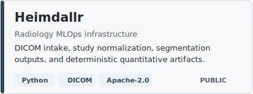
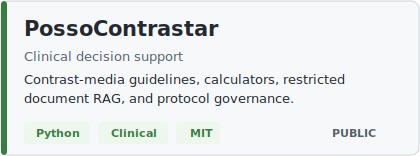
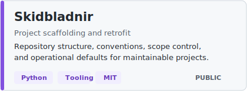
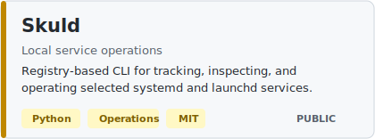

# Rodrigo Americo Cunha-de-Souza

Radiologist building applied software for radiology, medical imaging, and healthcare operations.

I work at the intersection of clinical practice, imaging infrastructure, automation, and AI-ready data pipelines. My public repositories are selected artifacts from a broader body of hands-on technical work developed alongside clinical and operational practice.

  
  
  
  
  

## What I Build

My work focuses on software that makes clinical imaging workflows more structured, observable, and operationally useful:

- DICOM intake, study normalization, metadata extraction, and imaging-data preparation
- radiology workflow automation across PACS, RIS, viewers, local services, and operational tools
- AI and analytics infrastructure that prepares clinical data for downstream models and decision systems
- decision-support applications grounded in medical protocols, governance, and real-world constraints
- pragmatic developer tooling for reproducible projects, local infrastructure, and maintainable operations

The common thread is not generic software development. It is domain-heavy engineering for environments where data quality, traceability, latency, interoperability, and clinical context matter.

## Featured Public Work

  <a href="https://github.com/rod-americo/Heimdallr">
    <picture>
      <source media="(prefers-color-scheme: dark)" srcset="./assets/repo-cards/heimdallr-dark.svg">
      
    </picture>
  </a>
  <a href="https://github.com/rod-americo/PossoContrastar">
    <picture>
      <source media="(prefers-color-scheme: dark)" srcset="./assets/repo-cards/posso-contrastar-dark.svg">
      
    </picture>
  </a>
  <a href="https://github.com/rod-americo/Skidbladnir">
    <picture>
      <source media="(prefers-color-scheme: dark)" srcset="./assets/repo-cards/skidbladnir-dark.svg">
      
    </picture>
  </a>
  <a href="https://github.com/rod-americo/Skuld">
    <picture>
      <source media="(prefers-color-scheme: dark)" srcset="./assets/repo-cards/skuld-dark.svg">
      
    </picture>
  </a>

Additional public tools include [md-to-pdf](https://github.com/rod-americo/md-to-pdf), a versioned Markdown-to-PDF generator, and [mCockpitExternalViewerBridge](https://github.com/rod-americo/mCockpitExternalViewerBridge), a DICOM viewer integration bridge.

## Technical Positioning

I am most interested in the layer that usually decides whether healthcare AI and automation work in practice: the infrastructure beneath the interface.

That includes data ingestion, naming conventions, identifiers, retries, queues, auditability, segmentation outputs, local runtime behavior, protocol governance, and the operational feedback loops around them. In clinical systems, these details are not implementation trivia. They determine whether a tool can be trusted, repeated, maintained, and integrated.

## Operating Principles

- Build close to real clinical workflows, not abstract demos.
- Prefer observable systems over opaque automation.
- Treat interoperability and governance as product requirements.
- Keep patient data and institution-specific logic out of public repositories.
- Use open repositories to publish reusable abstractions, tooling, and technical direction.

## Current Direction

I am developing public foundations for radiology operations and medical-imaging AI: cleaner imaging pipelines, structured quantitative outputs, protocol-aware decision support, and tooling that helps clinical teams move from informal scripts to maintainable systems.

Public repositories here are intentionally selective. Some work remains private because it depends on clinical context, non-public systems, experimental infrastructure, or data that should not be exposed.

## Contact

- Email: [rodrigoamerico@gmail.com](mailto:rodrigoamerico@gmail.com)
- LinkedIn: [linkedin.com/in/rodrigoamerico](https://www.linkedin.com/in/rodrigoamerico)
- GitHub: [github.com/rod-americo](https://github.com/rod-americo)
